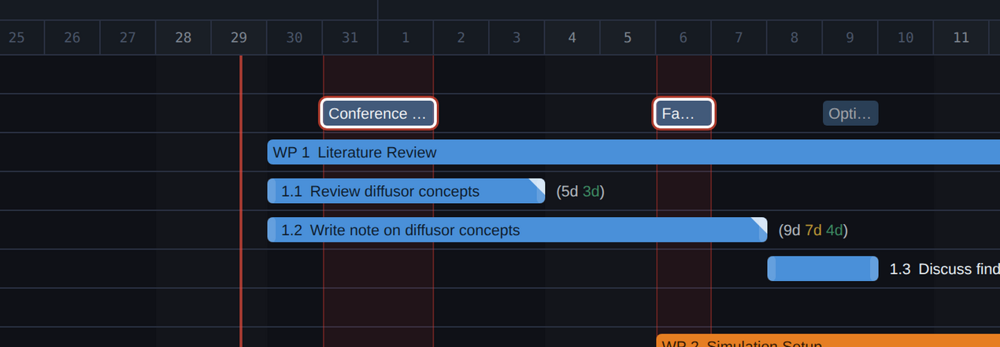
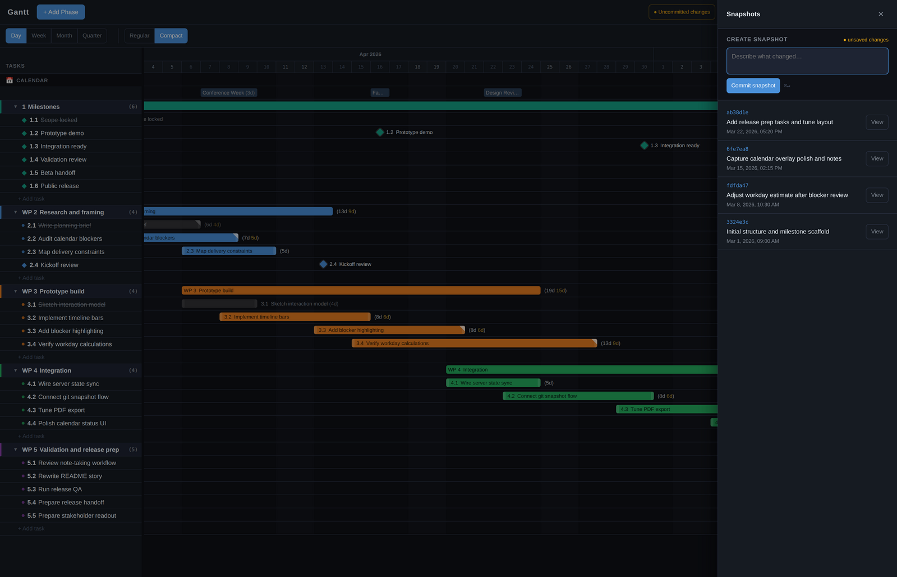

#  Gantt App

A local-first Gantt planner for people who need a schedule that reflects real life, not just ideal dates.

It lets you plan tasks alongside your actual calendar, highlight events as blockers, and see how many real workdays remain inside a task window after weekends and selected calendar events are removed.

<p align="center">
  
</p>

## What This App Is

This is a focused personal planning tool. It runs locally on your own machine, stores your data in local JSON files, and can optionally use Git to keep a lightweight snapshot history of planning changes.

## Why It Is Useful

Most Gantt charts only show the dates you typed in.

This app is built around a more useful planning question: how much real time is actually available once weekends and your existing calendar commitments are taken into account?

That makes it useful for students, researchers, freelancers, consultants, and solo builders who want a clear plan without moving to a large multi-user project system.

## Key Features

- Local-first planning on your own machine
- Recursive groups, tasks, and milestones on one timeline
- Day, week, month, and quarter views
- Real available workday calculations on task and group labels
- Calendar overlay from iCal feeds or Google Calendar OAuth
- Multi-calendar groups with labels, colors, ordering, and collapse state
- Task notes stored with the task itself
- Multi-select, bulk drag, and quick batch subtask creation
- PDF export
- Optional Git-backed snapshot history for planning data and GUI state
- Optional external data directory via `GANTT_DATA_DIR`

## Example Views

<p align="center">
  
</p>

<p align="center">
  
</p>

## Quick Start

1. Start the app from your installed launcher or local source checkout.
2. Click `Connect Calendar`.
3. Add an iCal URL for the fastest test, or configure Google Calendar OAuth.
4. Create a group and a task.
5. In Day view, double-click a calendar entry to toggle it as a blocker and watch the available workday count update.
6. Adjust the task until the available workdays match what you think the task really needs.
7. Optional: open `History` and save a snapshot.

## Install On Windows

Preferred installer flow:

1. Download `GanttApp-Setup-<version>.exe` from the latest GitHub release and run it.
2. Keep the default per-user install path unless you have a reason to change it.
3. Launch `Gantt App` from the Start Menu or desktop shortcut.

The installer bundles the app into `Gantt App.exe`, does not require Node.js to be preinstalled, stores config in `%LOCALAPPDATA%\GanttApp\config`, stores planning data in `%LOCALAPPDATA%\GanttApp\data`, and adds Start Menu shortcuts for `Gantt App` and `Stop Gantt App`.

Windows source setup for contributors:

1. Install Node.js 20+ from [nodejs.org](https://nodejs.org/).
2. Optional: install Git from [git-scm.com](https://git-scm.com/) if you want snapshot history or a private Git-backed data repo.
3. Clone or download this repo.
4. Double-click `install-windows.cmd`.
5. Double-click `launch-windows.cmd`.

Build Windows releases from source:

```bash
npm run build:windows:exe
```

This creates `dist/windows/Gantt App.exe`.

```bash
npm run build:windows:installer
```

This creates both `dist/windows/Gantt App.exe` and `dist/installer/GanttApp-Setup-<version>.exe`.

Notes:

- the release version comes from `package.json`
- `build:windows:installer` expects Inno Setup to be installed on the Windows machine that builds it

Manual ZIP fallback for contributors:

```powershell
powershell -ExecutionPolicy Bypass -File .\setup.ps1
powershell -ExecutionPolicy Bypass -File .\create-windows-shortcut.ps1
```

## Install On macOS

1. Install Node.js 20+ from [nodejs.org](https://nodejs.org/).
2. Optional: install Git if you want snapshot history or a private Git-backed data repo.
3. Download this repo as a ZIP or clone it.
4. Move the folder somewhere permanent.
5. Run:

```bash
./setup.sh
./create-launcher.sh
```

By default this creates `~/Applications/Gantt App.app`.

## Install On Linux

1. Install Node.js 20+ using your preferred Linux install path.
2. Optional: install Git if you want snapshot history or a private Git-backed data repo.
3. Download this repo as a ZIP or clone it.
4. Move the folder somewhere permanent.
5. Run:

```bash
./setup.sh
./create-launcher.sh
```

The helper creates a launcher in `~/.local/share/applications` and usually also a desktop shortcut.

## Running The App

Simple everyday use:

- Windows: launch `Gantt App` from the installed Start Menu shortcut or your local source launcher
- macOS: open the app created by `./create-launcher.sh`
- Linux: open the launcher created by `./create-launcher.sh`

By default the app runs at `http://localhost:3000`.

If no data files exist yet, the app starts with an empty plan. By default it stores local data inside `data/` in a source checkout, or `%LOCALAPPDATA%\GanttApp\data` in the packaged Windows app. If you set `GANTT_DATA_DIR`, the app uses that directory instead.

## For Contributors

Development servers:

- Windows: `powershell -ExecutionPolicy Bypass -File .\start.ps1`
- macOS/Linux: `./start.sh`
- Manual equivalent: `npm run dev`

That runs Express on `http://localhost:3000` and Vite on `http://localhost:5173`.

Single-port production run:

- Windows packaged app: run `Gantt App.exe`
- Source checkout: `npm run build` then `npm start`

Windows release build commands:

```bash
npm run build:windows:exe
npm run build:windows:installer
```

## Optional: Git-Backed Snapshots And Private Data Repo

The app works without Git. Git is only required for the snapshot/history workflow.

If the app's data directory is a Git repository:

- the History panel can create named snapshots
- the app can browse recent snapshots
- you can open older states read-only
- you can restore an older snapshot as the current plan

The app-created snapshot flow stages and commits:

- `tasks.json`
- `state.json`

Other files in the same data directory, such as `calendar-config.json` or `tokens.json`, are not included in app-created snapshots.

If you want to keep planning data separate from the software repo, set `GANTT_DATA_DIR` in `.env` to your own private directory.

Example `.env` values:

```env
# Windows example
GANTT_DATA_DIR=C:/Users/you/Documents/gantt_app_data

# macOS example
# GANTT_DATA_DIR=/Users/you/Documents/gantt_app_data

# Linux example
# GANTT_DATA_DIR=/home/you/gantt_app_data
```

Typical setup:

```bash
mkdir -p /path/to/your/gantt_app_data
cd /path/to/your/gantt_app_data
git init
```

Then set `GANTT_DATA_DIR` in `.env` and restart the app.

## Optional: Autostart On Login

Autostart is intentionally separate from normal launch. Nothing in the helper scripts enables it automatically, and the Windows installer only enables it if you choose to wire that up yourself later.

## Troubleshooting

**`node` or `npm` is not found**

Install Node.js 20+ first, then rerun the setup helper or Windows build/install flow.

**PowerShell blocks `setup.ps1` or `start.ps1`**

Run them with:

```powershell
powershell -ExecutionPolicy Bypass -File .\setup.ps1
powershell -ExecutionPolicy Bypass -File .\start.ps1
```

**Port already in use**

Set a different `PORT` in `.env`, then restart the app. If you use Google Calendar OAuth, update the redirect URI in Google Cloud to `http://localhost:<PORT>/api/calendar/callback`.

**History panel says snapshots are unavailable**

Basic planning still works. For snapshots, install Git and make sure the app's data directory is a Git repository.

**Google Calendar shows `redirect_uri_mismatch`**

The redirect URI in Google Cloud must exactly match `http://localhost:<PORT>/api/calendar/callback`.

## Scope / Limitations

- Windows now has a packaged `.exe` and an Inno Setup installer, but macOS and Linux still use helper scripts from this repo.
- It is designed for personal and self-managed work, not team collaboration.
- Calendar overlay is optional, but Google OAuth still requires a localhost callback setup.
- Git-backed snapshots depend on Git being installed and available on `PATH`.

## Credits

This project is built on top of open-source software. In particular, thanks to:

- [Node.js](https://nodejs.org/)
- [Express](https://expressjs.com/)
- [React](https://react.dev/)
- [Vite](https://vitejs.dev/)
- [wx-react-gantt](https://www.npmjs.com/package/wx-react-gantt)
- [node-ical](https://www.npmjs.com/package/node-ical)
- [googleapis](https://www.npmjs.com/package/googleapis)
- [html2canvas](https://html2canvas.hertzen.com/)
- [jsPDF](https://github.com/parallax/jsPDF)
- [jsPDF-AutoTable](https://github.com/simonbengtsson/jsPDF-AutoTable)
