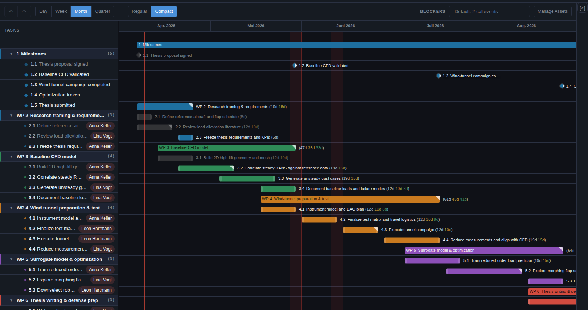
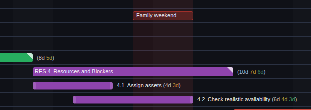
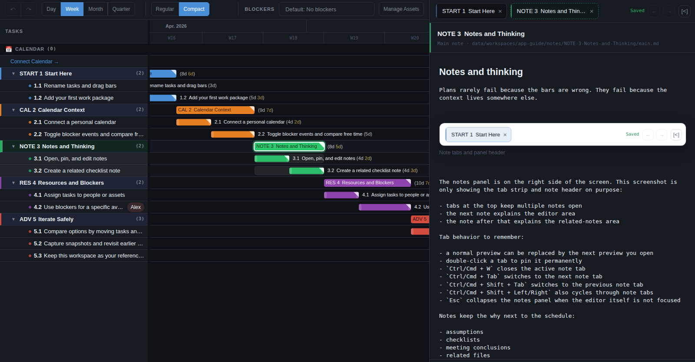
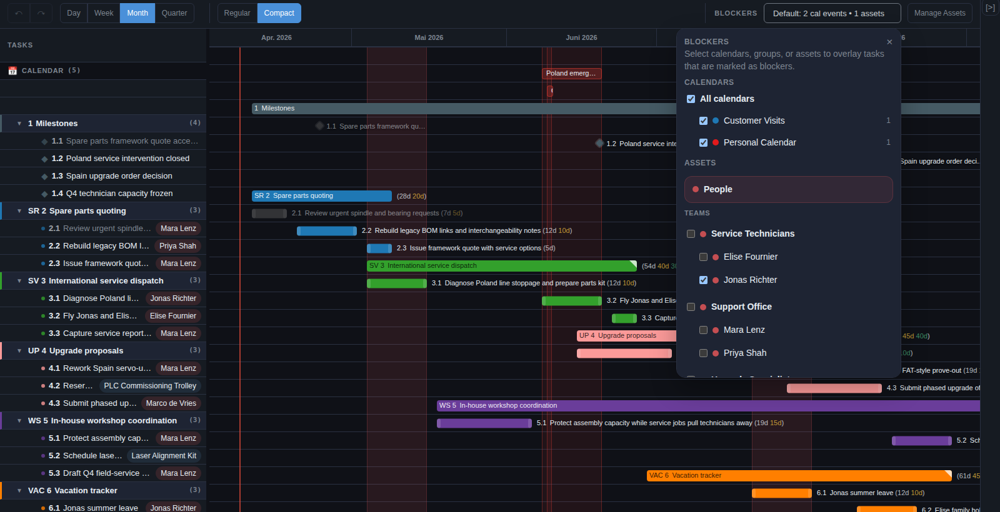
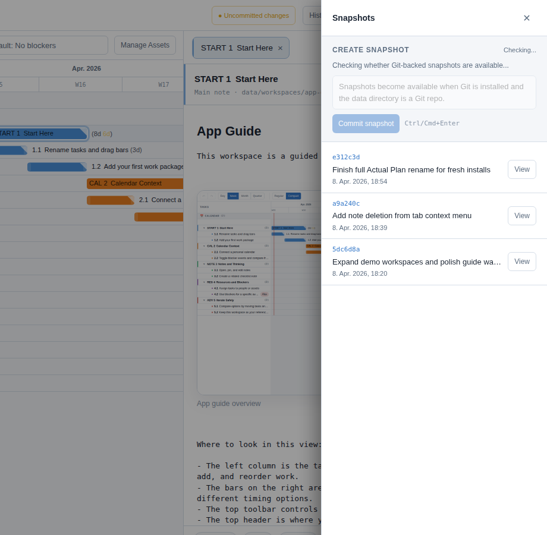

#  Actual Plan

A local-first Gantt planner for people who need a schedule that reflects real life, not just ideal dates.

Plan work against your actual calendar, compare scenarios before you commit, keep notes beside the timeline, and answer practical availability questions for yourself, teammates, or shared assets.

<p align="center">
  
</p>

## Why Actual Plan Exists

Most Gantt tools are either expensive, clunky, or built for a team process that feels too heavy for personal planning.

Actual Plan started from a simpler need: making confident decisions when several important parts of life overlap. A master's thesis, coaching work, freelance responsibilities, travel, and optional sailing projects do not fit neatly into a traditional calendar. You can often make something work with a best guess, but it is much easier to decide well when you can actually see the tradeoffs.

This app is built around a more useful planning question: how much real time is actually available once weekends and your existing calendar commitments are taken into account?

That makes it useful for students, researchers, freelancers, consultants, and solo builders who want a clear plan without moving to a large multi-user project system.

## What Makes It Different

- Local-first workspaces on your own machine
- Plain JSON, Markdown, and `.ics` files instead of a proprietary cloud format
- Calendar-aware planning with blocker overlays and real available-workday calculations
- Integrated notes panel with tabs, markdown editing, and related notes
- Task assignment for people and assets, plus focused blocker scenarios
- Built-in dark and light modes
- Git-backed snapshots when you want to compare options safely
- Example workspaces that demonstrate planning patterns instead of empty demo data

## Plan Against Reality

Actual Plan combines a classic Gantt timeline with personal calendar context. In day, week, month, and quarter views, you can keep fixed commitments visible, activate specific calendar events as blockers, and see how much uninterrupted time is still left for the work that matters.

That is the core workflow: move the bars, toggle the real constraints, and compare the result before you commit.

## See Actual Days Available

This is one of the strongest parts of the app.

Nice-looking plans can still be stupid plans if they ignore weekends, existing commitments, and the actual interruptions already sitting on your calendar.

Task and group labels surface the available-day counts directly on the timeline, so you stop guessing based on bars that merely look long enough. You can see immediately when a task window only looks generous on the chart but does not contain enough real working time after weekends and active blockers are removed.

With the real numbers in front of you, you can simply reschedule until the plan matches the time the task actually needs. Reality beats Gantt fantasy here.

In the screenshot below, the task window still spans `6d`, but once the family-weekend blocker and the weekend itself are counted, only `3d` remain realistically available.

<p align="center">
  
</p>

## Keep The Why Next To The Plan

Plans rarely fail because the bars are wrong. They fail because the reasoning lives somewhere else.

The notes panel keeps context inside the workspace itself: assumptions, checklists, meeting conclusions, related files, and short support notes that belong to the task. Notes open in tabs, stay linked to the schedule, and make the app feel more like a working knowledge base than a disconnected chart.

<p align="center">
  
</p>

## Ask Focused Availability Questions

This app is not trying to paint the whole screen red all the time. The blocker system is strongest when you use it to answer a concrete question.

Assign tasks to people or assets, then open the blocker menu and narrow the view to only the calendars, groups, or members that matter for the decision in front of you. That makes it easy to answer questions like:

- Can Alex still take this client job?
- When is the van free?
- Do we have a clean camp window with coach, rib, and trailer all available?

<p align="center">
  
</p>

## Iterate Safely

Good planning is usually iterative. Try an option, see what it does to the schedule, adjust the dates, update the notes, and keep the version that still makes sense.

If your data directory is a Git repository, the History panel can create lightweight snapshots, browse recent plan versions, open older states read-only, and restore a previous snapshot when you want to roll back to a better decision.

The screenshot below is shown in light mode on purpose so you can see that both light and dark themes are built in.

<p align="center">
  
</p>

## Local Files, Not Lock-In

One of the best things about Actual Plan is that your planning data stays local and readable.

Your workspace is not trapped inside a database that only one vendor understands. It lives in normal files on your machine, for example:

```text
workspace/
├── tasks.json
├── state.json
├── personnel.json
├── calendar-config.json
├── calendars/
│   └── *.ics
└── notes/
    └── .../main.md
```

That means:

- your data is private by default and easy to back up
- your planning files are readable without the app
- Git works naturally when you want history
- AI agents can inspect and modify the plan directly instead of working through a locked UI

If you want, you can point `GANTT_DATA_DIR` at a separate repo and let tools like Claude Code or Codex work directly in that data directory with full project context. Notes become an integrated knowledge base, tasks stay scriptable, and you can build your own skills, automations, and agent workflows around the plan you already own.

You are not waiting for some software company to maybe ship the AI integration you want someday. The data is yours. The workflow is yours. The app is ready for that.

## Who It Helps

Actual Plan works especially well for people who plan serious work without having a full PM office behind them:

- students and researchers balancing thesis work with real life
- freelancers and consultants juggling clients, travel, and delivery windows
- coaches, makers, and solo builders coordinating projects with limited time and equipment
- anyone who needs to compare options before choosing what to commit to

## Quick Start

1. Start the app from your installed launcher or local source checkout.
2. Open one of the example workspaces, or create your own workspace.
3. Click `Connect Calendar` and add an iCal URL, or configure Google Calendar OAuth.
4. Create a group and a task, then drag the bar until the timing feels plausible.
5. In Day or Week view, double-click a calendar event to activate it as a blocker.
6. Add a note so the reasoning lives next to the task, not in a separate app.
7. Optional: assign tasks to people or assets and use the blocker menu for focused availability checks.
8. Optional: open `History` and save a snapshot.

## Install On Windows

Preferred installer flow:

1. Download `ActualPlan-Setup-<version>.exe` from the latest GitHub release and run it.
2. Keep the default per-user install path unless you have a reason to change it.
3. Launch `Actual Plan` from the Start Menu or desktop shortcut.

The installer bundles the app into `Actual Plan.exe`, does not require Node.js to be preinstalled, stores config in `%LOCALAPPDATA%\ActualPlan\config`, stores planning data in `%LOCALAPPDATA%\ActualPlan\data`, and adds Start Menu shortcuts for `Actual Plan` and `Stop Actual Plan`.

Windows source setup for contributors:

1. Install Node.js 20+ from [nodejs.org](https://nodejs.org/).
2. Optional: install Git from [git-scm.com](https://git-scm.com/) if you want snapshot history or a private Git-backed data repo.
3. Clone or download this repo.
4. Double-click `install-windows.cmd`.
5. Double-click `launch-windows.cmd`.

Build Windows releases from source:

```bash
npm run build:windows:exe
```

This creates `dist/windows/Actual Plan.exe`.

```bash
npm run build:windows:installer
```

This creates both `dist/windows/Actual Plan.exe` and `dist/installer/ActualPlan-Setup-<version>.exe`.

Notes:

- the release version comes from `package.json`
- `build:windows:installer` expects Inno Setup to be installed on the Windows machine that builds it

Manual ZIP fallback for contributors:

```powershell
powershell -ExecutionPolicy Bypass -File .\setup.ps1
powershell -ExecutionPolicy Bypass -File .\create-windows-shortcut.ps1
```

## Install On macOS

A packaged macOS release is planned. For now, macOS uses the local source setup:

1. Install Node.js 20+ from [nodejs.org](https://nodejs.org/).
2. Optional: install Git if you want snapshot history or a private Git-backed data repo.
3. Download this repo as a ZIP or clone it.
4. Move the folder somewhere permanent.
5. Run:

```bash
./setup.sh
./create-launcher.sh
```

By default this creates `~/Applications/Actual Plan.app`.

## Install On Linux

Ubuntu 22.04+ `.deb` package:

1. Download `actual-plan_<version>_amd64.deb`.
2. Install it with:

```bash
sudo dpkg -i ./actual-plan_<version>_amd64.deb
```

3. Launch `Actual Plan` from your app menu or run:

```bash
actual-plan
```

The package is self-contained: it installs the app into `/opt/actual-plan`, bundles its own Node.js runtime and production dependencies, creates the launcher command `actual-plan`, and adds an app-menu entry for `Actual Plan`.

By default the installed app creates its per-user config in `~/.config/actual-plan/.env` and stores planning data in `~/Actual Plan Data`.

If you want a different default data directory or port at install time, set them when installing:

```bash
sudo ACTUAL_PLAN_DEFAULT_DATA_DIR="$HOME/Documents/Actual Plan Data" \
  ACTUAL_PLAN_DEFAULT_PORT=3001 \
  dpkg -i ./actual-plan_<version>_amd64.deb
```

Those install defaults are written to `/etc/actual-plan/install.env` and can be edited later.

Linux source setup for contributors:

1. Install Node.js 20+ using your preferred Linux install path.
2. Optional: install Git if you want snapshot history or a private Git-backed data repo.
3. Download this repo as a ZIP or clone it.
4. Move the folder somewhere permanent.
5. Run:

```bash
./setup.sh
./create-launcher.sh
```

The helper creates a launcher in `~/.local/share/applications` and usually also a desktop shortcut.

## Running The App

Simple everyday use:

- Windows: launch `Actual Plan` from the installed Start Menu shortcut or your local source launcher
- macOS: open the app created by `./create-launcher.sh`
- Linux: open the launcher created by `./create-launcher.sh` or use the packaged `actual-plan` command

Packaged installs default to `http://localhost:3000`. Source checkouts created from `.env.example` default to `http://localhost:3001` so both can coexist on the same machine.

If no data files exist yet, the app creates a clean multi-workspace data directory. On first start it includes an empty `Main Workspace` plus several persona-driven example workspaces with shipped notes and local `.ics` calendars, and opens the guide workspace by default. By default it stores local data inside `data/` in a source checkout, `%LOCALAPPDATA%\ActualPlan\data` in the packaged Windows app, or `~/Actual Plan Data` in the packaged Linux app. If you set `GANTT_DATA_DIR`, the app uses that directory instead.

## For Contributors

Development servers:

- Windows: `powershell -ExecutionPolicy Bypass -File .\start.ps1`
- macOS/Linux: `./start.sh`
- Manual equivalent: `npm run dev`

That runs Express on `http://localhost:3001` and Vite on `http://localhost:5173` when you use the default `.env.example`.

Single-port production run:

- Windows packaged app: run `Actual Plan.exe`
- Linux packaged app: run `actual-plan`
- Source checkout: `npm run build` then `npm start`

If you want your source checkout to use a different port, change `PORT` in `.env`.

Release build commands:

```bash
npm run build:linux:deb
npm run build:windows:exe
npm run build:windows:installer
```

## Optional: Git-Backed Snapshots And Private Data Repo

The app works without Git. Git is only required for the snapshot and history workflow.

If the app's data directory is a Git repository:

- the History panel can create named snapshots
- the app can browse recent snapshots
- you can open older states read-only
- you can restore an older snapshot as the current plan

The app-created snapshot flow stages and commits:

- `tasks.json`
- `state.json`

Other files in the same data directory, such as `calendar-config.json` or `tokens.json`, are not included in app-created snapshots.

If you want to keep planning data separate from the software repo, set `GANTT_DATA_DIR` in `.env` to your own private directory.

Example `.env` values:

```env
# Windows example
GANTT_DATA_DIR=C:/Users/you/Documents/actual_plan_data

# macOS example
# GANTT_DATA_DIR=/Users/you/Documents/actual_plan_data

# Linux example
# GANTT_DATA_DIR=/home/you/actual_plan_data
```

Typical setup:

```bash
mkdir -p /path/to/your/actual_plan_data
cd /path/to/your/actual_plan_data
git init
```

Then set `GANTT_DATA_DIR` in `.env` and restart the app.

## Optional: Autostart On Login

Autostart is intentionally separate from normal launch. Nothing in the helper scripts enables it automatically, and the Windows installer only enables it if you choose to wire that up yourself later.

## Troubleshooting

**`node` or `npm` is not found**

Install Node.js 20+ first, then rerun the setup helper or Windows build/install flow.

**PowerShell blocks `setup.ps1` or `start.ps1`**

Run them with:

```powershell
powershell -ExecutionPolicy Bypass -File .\setup.ps1
powershell -ExecutionPolicy Bypass -File .\start.ps1
```

**Port already in use**

Set a different `PORT` in `.env`, then restart the app. If you use Google Calendar OAuth, update the redirect URI in Google Cloud to `http://localhost:<PORT>/api/calendar/callback`.

**History panel says snapshots are unavailable**

Basic planning still works. For snapshots, install Git and make sure the app's data directory is a Git repository.

**Google Calendar shows `redirect_uri_mismatch`**

The redirect URI in Google Cloud must exactly match `http://localhost:<PORT>/api/calendar/callback`.

## Scope / Limitations

- It is designed for personal and self-managed work, not team collaboration.
- Calendar overlay is optional, but Google OAuth still requires a localhost callback setup.
- Git-backed snapshots depend on Git being installed and available on `PATH`.
- Windows and Ubuntu now have packaged release paths; macOS packaging is still planned.

## Credits

This project is built on top of open-source software. In particular, thanks to:

- [Node.js](https://nodejs.org/)
- [Express](https://expressjs.com/)
- [React](https://react.dev/)
- [Vite](https://vitejs.dev/)
- [wx-react-gantt](https://www.npmjs.com/package/wx-react-gantt)
- [node-ical](https://www.npmjs.com/package/node-ical)
- [googleapis](https://www.npmjs.com/package/googleapis)
- [html2canvas](https://html2canvas.hertzen.com/)
- [jsPDF](https://github.com/parallax/jsPDF)
- [jsPDF-AutoTable](https://github.com/simonbengtsson/jsPDF-AutoTable)
