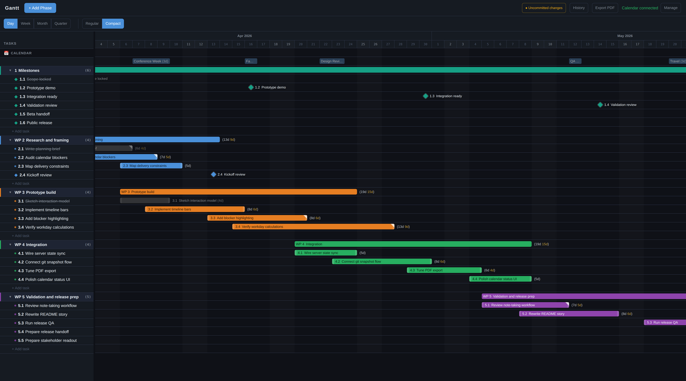

# Gantt App

A local-first Gantt planner for people who need a schedule that reflects real life, not just ideal dates.

It lets you plan tasks alongside your actual calendar, highlight events as blockers, and see how many real workdays remain inside a task window after weekends and selected calendar events are removed.

<p align="center">
  
</p>

## What This App Is

This is a focused personal planning tool. It runs locally on your own machine, stores your data in local JSON files, and optionally uses Git to keep a lightweight snapshot history of planning changes.

The app is not a desktop-packaged product in this repo yet. It is a cross-platform Node/React app that you run locally on Windows, macOS, or Linux.

## Why It Is Useful

Most Gantt charts only show the dates you typed in.

This app is built for a more practical question: given weekends and the commitments already on your calendar, how much real work time do you actually have?

That makes it useful for students, researchers, freelancers, consultants, and solo builders who want a clear plan without moving to a large multi-user project system.

## Key Features

- Local-first planning on your own machine
- Phases, tasks, and milestones on one timeline
- Day, week, month, and quarter views
- Real available workday calculations on task and phase labels
- Calendar overlay from iCal feeds or Google Calendar OAuth
- Task notes stored with the task itself
- Drag-to-move, drag-to-resize, and drag-to-reorder editing
- PDF export
- Optional Git-backed snapshot history for planning data and GUI state
- Optional external data directory via `GANTT_DATA_DIR`

## Quick Start

1. Install Node.js 20 or newer.
2. Optionally install Git if you want snapshot history or a private Git-backed data repo.
3. Get this repo by cloning it or downloading the ZIP.
4. Run the setup helper for your platform.
5. Start the app in the simplest way for your platform.
6. Open the local UI shown by the script.

Default helper behavior:

- `setup.ps1` and `setup.sh` install dependencies and create `.env` from `.env.example` if needed.
- Windows daily use is `launch-windows.cmd`, which starts the single-port app and shows a popup with the local URL.
- The main user-facing goal is simple local launch, not choosing between multiple runtime modes.

## Install On Windows

Install:

- Node.js 20+ from [nodejs.org](https://nodejs.org/)
- Optional: Git from [git-scm.com](https://git-scm.com/) if you want snapshot history or a private Git-backed data repo

Get the repo:

- Download the ZIP from GitHub and extract it, or
- Clone it with Git:

```powershell
git clone https://github.com/MoritzBur/gantt_app.git
cd gantt_app
```

Run setup:

```powershell
powershell -ExecutionPolicy Bypass -File .\setup.ps1
```

Start the app for normal daily use:

```powershell
.\launch-windows.cmd
```

That starts the single-port app and shows a popup when it is ready. By default the URL is `http://localhost:3000`.

Optional: create a desktop shortcut:

```powershell
powershell -ExecutionPolicy Bypass -File .\create-windows-shortcut.ps1
```

You can set a custom icon on the shortcut later, or rerun the shortcut helper with `-IconPath` after you have an `.ico` file.

If you want the shortcut to open the browser too, run the shortcut helper with `-OpenBrowser`.

## Install On macOS

Install:

- Node.js 20+ from [nodejs.org](https://nodejs.org/)
- Optional: Git if you want snapshot history or a private Git-backed data repo

Get the repo:

- Download the ZIP from GitHub and extract it, or
- Clone it with Git:

```bash
git clone https://github.com/MoritzBur/gantt_app.git
cd gantt_app
```

Run setup:

```bash
./setup.sh
```

Start the app:

```bash
./start.sh --prod
```

Then open `http://localhost:3000`.

## Install On Linux

Install:

- Node.js 20+ using your distro package, NodeSource, nvm, Volta, or another normal Linux install path
- Optional: Git if you want snapshot history or a private Git-backed data repo

Get the repo:

- Download the ZIP from GitHub and extract it, or
- Clone it with Git:

```bash
git clone https://github.com/MoritzBur/gantt_app.git
cd gantt_app
```

Run setup:

```bash
./setup.sh
```

Start the app:

```bash
./start.sh --prod
```

Then open `http://localhost:3000`.

## Running The App

Simple everyday use:

- Windows: double-click `launch-windows.cmd` or a shortcut created by `create-windows-shortcut.ps1`
- macOS/Linux: `./start.sh --prod`

Windows launcher behavior:

- it starts the single-port app on `http://localhost:3000` by default, or your configured `PORT`
- it waits for the app to be ready
- it shows a popup telling you the local URL
- if the app is already running, it tells you that instead of starting a second copy

If no data files exist yet, the app starts with an empty plan. By default it stores local data in `data/` inside the repo and creates missing files on first save. If you set `GANTT_DATA_DIR`, the app uses that directory instead.

Single-port runs serve the frontend and API from the same local port, so you open `http://localhost:3000` unless you changed `PORT` in `.env`.

## For Contributors

If you are working on the app itself, you can use the development servers:

- Windows: `powershell -ExecutionPolicy Bypass -File .\start.ps1`
- macOS/Linux: `./start.sh`

That runs Express on `http://localhost:3000` and Vite on `http://localhost:5173`.

If you want a direct single-port console run instead of the normal launcher flow:

- Windows: `powershell -ExecutionPolicy Bypass -File .\start.ps1 -Production`
- macOS/Linux: `./start.sh --prod`
- Manual equivalent: `npm run build` then `npm start`

Optional calendar setup:

- The app works without any calendar integration.
- iCal is the simplest option and only needs `ICAL_URLS` in `.env`.
- Google Calendar OAuth needs `CALENDAR_BACKEND=google`, Google client credentials, and a redirect URI that matches `http://localhost:<PORT>/api/calendar/callback`.

## Optional: Git-Backed Snapshots And Private Data Repo

The app works without Git. Git is only required for the snapshot/history workflow.

If the app's data directory is a Git repository:

- the History panel can create named snapshots
- the app can browse recent snapshots
- you can open older states read-only
- you can restore an older snapshot as the current plan

The app-created snapshot flow stages and commits:

- `tasks.json`
- `state.json`

Other files in the same data directory, such as `calendar-config.json` or `tokens.json`, are not included in app-created snapshots.

If you want to keep planning data separate from the software repo, set `GANTT_DATA_DIR` in `.env` to your own private directory. That directory can also be its own private Git repo.

Example `.env` values:

```env
# Windows example
GANTT_DATA_DIR=C:/Users/you/Documents/gantt_app_data

# macOS example
# GANTT_DATA_DIR=/Users/you/Documents/gantt_app_data

# Linux example
# GANTT_DATA_DIR=/home/you/gantt_app_data
```

Typical setup:

```bash
mkdir -p /path/to/your/gantt_app_data
cd /path/to/your/gantt_app_data
git init
```

Then set `GANTT_DATA_DIR` in `.env` and restart the app.

This is a strong setup for technical users because it gives you private local data, versioned planning history, and optional syncing to your own remote if you want it, while keeping the app source repo separate.

## Optional: Autostart On Login

Autostart is intentionally separate from normal launch. Nothing in setup enables it automatically.

The default workflow is still:

- run the launcher or start script manually
- open the browser yourself
- stop the app when you are done

If you want autostart later, keep it per-user and easy to undo:

- Windows: add a shortcut to `launch-windows.cmd -Quiet` in your Startup folder, or use a Scheduled Task if you want a quieter background launch
- macOS: use Login Items for a wrapper app or terminal workflow, or create a LaunchAgent that runs `start.sh`
- Linux: use your desktop environment's autostart settings, a `.desktop` entry, or a user service

Some users want the backend to start quietly without opening a browser on login. Keep those concerns separate. This repo does not force browser-opening as part of autostart.

## Troubleshooting

**`node` or `npm` is not found**

Install Node.js 20+ first, then rerun the setup helper.

**PowerShell blocks `setup.ps1` or `start.ps1`**

Run them with:

```powershell
powershell -ExecutionPolicy Bypass -File .\setup.ps1
powershell -ExecutionPolicy Bypass -File .\start.ps1
```

**The Windows launcher says the app is already running**

Open the URL shown in the popup. If you expected a fresh start, close the existing Gantt App PowerShell window first and then launch again.

**The Windows launcher says the port is already in use**

Another app is already using that port. Change `PORT` in `.env` or stop the other app.

**`setup.sh` or `start.sh` is not executable**

Run once:

```bash
chmod +x setup.sh start.sh
```

**Missing `.env` or missing `SESSION_SECRET`**

Run the setup helper. If `.env` already exists, make sure it contains a real `SESSION_SECRET`.

**Port already in use**

Set a different `PORT` in `.env`, then restart the app. If you use Google Calendar OAuth, update the redirect URI in Google Cloud to `http://localhost:<PORT>/api/calendar/callback`.

**History panel says snapshots are unavailable**

Basic planning still works. For snapshots, install Git and make sure the app's data directory is a Git repository.

**Google Calendar shows `redirect_uri_mismatch`**

The redirect URI in Google Cloud must exactly match `http://localhost:<PORT>/api/calendar/callback` for the port you are using.

## Scope / Limitations

- This repo is a local app, not a native packaged desktop installer yet.
- It is designed for personal and self-managed work, not team collaboration.
- Calendar overlay is optional, but Google OAuth still requires a localhost callback setup.
- Git-backed snapshots are powerful for technical users, but they depend on Git being installed and available on `PATH`.

## Credits
