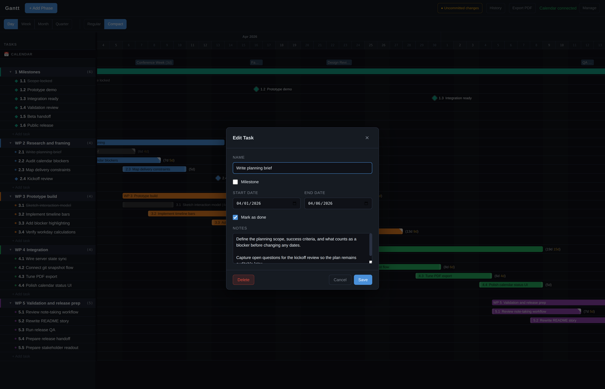

# Gantt App

A local-first Gantt planner for people who need a schedule that reflects real life, not just ideal dates.

This app lets you plan tasks alongside your actual calendar, double-click calendar events to treat them as blockers, and see task bars update to show how many workdays are really available inside a task window.

<p align="center">
  
</p>

## Why This Is Useful

Most Gantt charts answer: "What dates did I put on the chart?"

This tool is built to answer a more practical question: "Given weekends and the commitments already on my calendar, how much real work time do I actually have?"

When calendar events are highlighted, task and phase labels show:

- `Nd` total calendar span
- second `Nd` weekdays only
- third `Nd` net available workdays after highlighted calendar events are removed

That is the core idea of the app. A task may span nine calendar days, contain seven weekdays, and still leave only four realistically available workdays once calendar blockers are taken into account.

<p align="center">
  
</p>

## Best Fit

This app is a good fit for:

- students and researchers planning around classes, meetings, and deadlines
- solo builders, consultants, and freelancers planning around a real personal calendar
- anyone who likes the clarity of a Gantt chart but does not want a large multi-user PM system

It is not trying to be a full enterprise project platform.

## Current Features

- local-first planning on your own machine
- phases, tasks, and milestones on one timeline
- calendar overlay from iCal feeds or Google Calendar OAuth
- double-click calendar event highlighting across the chart
- real available workday calculation on task and phase labels
- task notes stored with the task itself
- day, week, month, and quarter views
- regular and compact density modes
- drag-to-move, drag-to-resize, and drag-to-reorder editing
- PDF export
- git-backed snapshot history for planning data and GUI state
- external private data directory support via `GANTT_DATA_DIR`

## Snapshot History That Stays With The Plan

If your data directory is a git repository, the app can use git as a lightweight snapshot system for planning changes. That gives you named checkpoints for both planning data and GUI state without turning the app into a hosted service.

<p align="center">
  
</p>

From the UI you can:

- create named snapshots
- browse recent snapshots
- open older states read-only
- restore an earlier snapshot as the current plan

## Keep Notes On The Task Itself

Tasks can carry their own notes, so planning context stays attached to the work instead of getting lost in a separate document or chat thread.

<p align="center">
  
</p>

## Honest Scope

This is a focused planning tool for personal and self-managed work.

It is intentionally not a full PM suite. There is no team collaboration model, permissions system, comment workflow, resource management layer, or enterprise reporting stack. If that is what you need, this is probably the wrong tool.

## Install

### Requirements

- **Node.js 20+**: [nodejs.org](https://nodejs.org)

### Clone and install

```bash
git clone https://github.com/MoritzBur/gantt_app.git
cd gantt_app
npm install
cp .env.example .env
```

At minimum, set:

```env
SESSION_SECRET=any-long-random-string
```

### Run in development

```bash
npm run dev
```

By default this starts:

- the Express backend on `http://localhost:3000`
- the Vite frontend on `http://localhost:5173`

Open `http://localhost:5173`.

### Build and run

```bash
npm run build
npm start
```

In production mode the Express server serves the built frontend from the same port.

## Private Data Repo With `GANTT_DATA_DIR`

The software repo can be public while your actual planning data stays private.

Set `GANTT_DATA_DIR` to a directory outside this repo:

```env
GANTT_DATA_DIR=/absolute/path/to/private/gantt_app_data
```

That external directory can be its own private git repository. A typical layout looks like this:

```text
gantt_app_data/
├── tasks.json
├── state.json
├── calendar-config.json
└── tokens.json
```

What this separation gives you:

- this public repo contains the app source code
- your private data repo contains your tasks, UI state, and calendar credentials/config
- the app can be published publicly without exposing planning data

Important detail:

- the built-in snapshot UI stages and commits `tasks.json` and `state.json`
- `calendar-config.json` and `tokens.json` can live in the same private repo, but they are not included in app-created snapshots

Recommended setup:

```bash
mkdir -p /home/you/private/gantt_app_data
cd /home/you/private/gantt_app_data
git init
```

Then add `GANTT_DATA_DIR` to `.env` and restart the app.

## Calendar Setup

The calendar overlay is optional. The app still works as a plain local Gantt planner without it.

### Option A: iCal feed

This is the simplest setup. It works with Google Calendar, Apple Calendar, Outlook, Fastmail, and other services that expose an iCal feed.

Add this to `.env`:

```env
CALENDAR_BACKEND=ical
SESSION_SECRET=any-long-random-string
ICAL_URLS=https://calendar.google.com/calendar/ical/...your-private-url.../basic.ics
```

If you use multiple calendars, separate the URLs with commas.

### Option B: Google Calendar OAuth

Use this if you want Google Calendar API access instead of a secret iCal URL.

```env
CALENDAR_BACKEND=google
SESSION_SECRET=any-long-random-string
GOOGLE_CLIENT_ID=your-client-id.apps.googleusercontent.com
GOOGLE_CLIENT_SECRET=your-client-secret
GOOGLE_CALENDAR_IDS=your.email@gmail.com
```

Then click **Connect Calendar** in the app.

<details>
<summary>Google OAuth setup</summary>

1. Create a project in [Google Cloud Console](https://console.cloud.google.com)
2. Enable the **Google Calendar API**
3. Create an OAuth 2.0 Client ID for a web application
4. Add this redirect URI exactly: `http://localhost:3000/api/calendar/callback`
5. Copy the client ID and secret into `.env`
6. Start the app and sign in through **Connect Calendar**

</details>

## Troubleshooting

**Missing required environment variable**

Copy `.env.example` to `.env` and set `SESSION_SECRET`. For iCal mode, `SESSION_SECRET` and `ICAL_URLS` are enough.

**Calendar still shows "Connect Calendar" after adding `ICAL_URLS`**

Check that the URL is correct and reachable. The server log prints `[iCal]` errors if loading fails.

**Google shows `redirect_uri_mismatch`**

Your Google Cloud OAuth client must use exactly:
`http://localhost:3000/api/calendar/callback`

**Port already in use**

Set `PORT=3001` in `.env`. If you use Google OAuth, update the Google redirect URI to match the new port.

## Future Directions

These are ideas, not current features:

- writing planned work blocks back to a calendar instead of only reading calendar data
- better handling of multiple calendars with clearer separation of personal, work, and project time
- cross-project planning where overlapping projects compete for the same real availability
- richer capacity planning beyond simple date blocking
- desktop packaging for macOS, Windows, and Linux

## Credits

This project is built on well-established open-source tools and APIs:

- **React** and **Vite** for the frontend
- **Express** for the local backend
- **node-ical** for iCal calendar feeds
- **googleapis** for Google Calendar OAuth access
- **html2canvas**, **jsPDF**, and **jspdf-autotable** for PDF export
