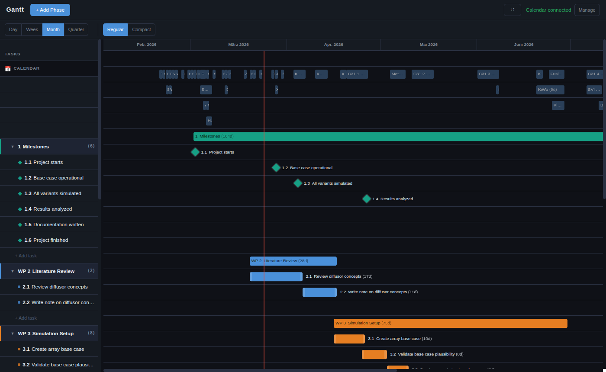
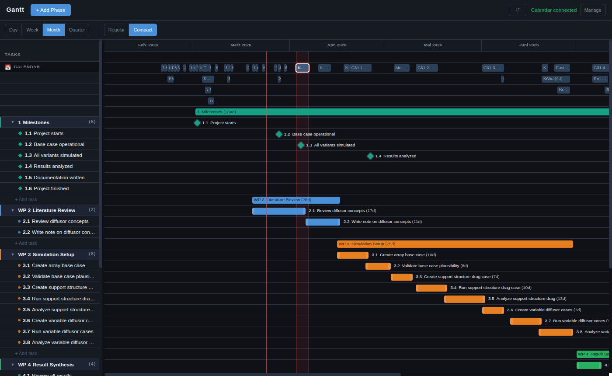
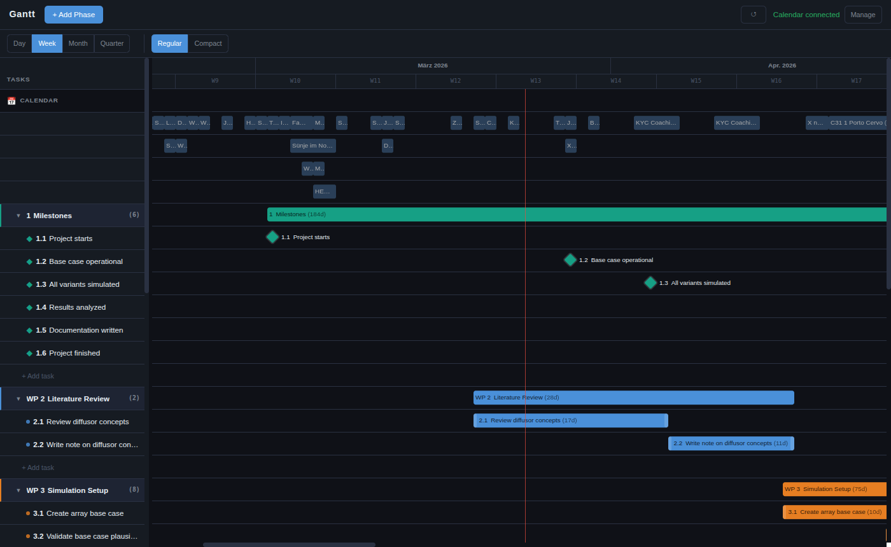
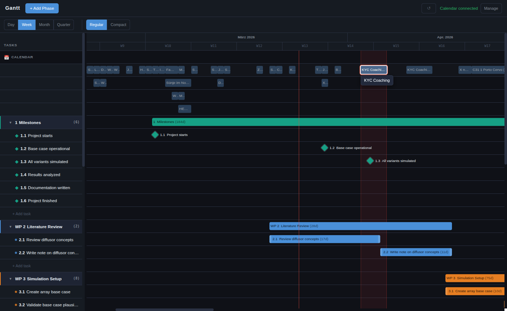

# Gantt App

A personal project planning tool that runs entirely on your own machine. Plan your work in a clean Gantt chart and see it side-by-side with your real calendar — so you can schedule around your actual life, not just theory.



---

## Features

- **Phases & tasks** — Organise work into phases (work packages) with subtasks. Phase bars auto-expand to cover their tasks.
- **Milestones** — Mark key dates as diamond markers. Included in phase bounds.
- **Drag to reschedule** — Drag task bars to move them, or pull the left/right handles to resize. Start and end dates show live next to the bar while dragging, including day of week.
- **Smart labels** — Task names and duration `(Nd)` are shown inside the bar when they fit, or floated to the right when the bar is too narrow.
- **Calendar overlay** — Connect your calendar via iCal URL or Google OAuth. Events appear as read-only bars in their own lanes above your tasks.
- **Calendar focus mode** — Double-click any personal calendar event to activate it. A translucent red band stretches down the full chart so you can instantly see which tasks overlap. Activate multiple events at once.
- **Real available workdays** — When calendar events are highlighted, task and phase bars show total span, weekdays, and net available workdays after weekends and the selected personal events are taken into account.
- **Zoom levels** — Day / Week / Month / Quarter views.
- **Compact density** — Tighter row height for seeing more at once.
- **Drag to reorder** — Reorder phases and tasks within phases by dragging the left-panel rows.



---

## Calendar overlay

Events sit above your Gantt tasks and let you reason about your schedule in context.

**Week view:**



**Double-click a personal calendar event** to highlight it with a red vertical band across all tasks:



While one or more events are active, duration labels update to show:

- `Nd` = full calendar span
- second `Nd` = weekdays only (weekends removed)
- third `Nd` = real available workdays after removing both weekends and the highlighted personal calendar events

That makes it much easier to see whether a task that looks like "10 days" on the chart really contains only 6 workable days once life is accounted for.

---

## Requirements

- **Node.js v20+** — [nodejs.org](https://nodejs.org)

---

## Install

```bash
git clone https://github.com/your-username/gantt-app
cd gantt-app
npm install
cp .env.example .env
# edit .env — at minimum set SESSION_SECRET to any long random string
```

---

## Run

```bash
npm run dev
```

Opens two processes:
- Express backend on **port 3000**
- Vite dev server on **port 5173**

Visit **http://localhost:5173**

### Production (single process)

```bash
npm run build
npm start        # serves everything on port 3000
```

---

## Calendar setup

The calendar overlay is optional — the app works without it.

### Option A — iCal (easiest)

Works with Google Calendar, Apple Calendar, Outlook, Fastmail, and anything that exports iCal. No Google Cloud account needed.

1. Get your secret iCal URL from your calendar app (in Google Calendar: Settings → your calendar → *Secret address in iCal format*)
2. Add to `.env`:

```
CALENDAR_BACKEND=ical
SESSION_SECRET=any-long-random-string
ICAL_URLS=https://calendar.google.com/calendar/ical/...your-private-url.../basic.ics
```

Multiple calendars: comma-separate the URLs.

### Option B — Google Calendar API (OAuth)

Requires a Google Cloud project with the Calendar API enabled and an OAuth 2.0 Client ID.

```
CALENDAR_BACKEND=google
SESSION_SECRET=any-long-random-string
GOOGLE_CLIENT_ID=your-client-id.apps.googleusercontent.com
GOOGLE_CLIENT_SECRET=your-client-secret
GOOGLE_CALENDAR_IDS=your.email@gmail.com
```

Then click **Connect Calendar** in the app and sign in with Google. See the full OAuth setup walkthrough below.

<details>
<summary>Full Google OAuth setup</summary>

1. Go to [console.cloud.google.com](https://console.cloud.google.com) and create a new project
2. Enable the **Google Calendar API** (APIs & Services → Library)
3. Create an OAuth 2.0 Client ID (APIs & Services → Credentials → Create Credentials):
   - Application type: **Web application**
   - Authorised redirect URI: `http://localhost:3000/api/calendar/callback`
4. Copy the Client ID and Client Secret into `.env`
5. Start the app, click **Connect Calendar**, and sign in

The access token is saved to `server/tokens.json` so you won't need to re-authenticate on restart.

</details>

---

## File structure

```
gantt-app/
├── .env.example          # Template for secrets
├── data/
│   └── tasks.json        # Your task data (auto-saved on every change)
├── server/
│   ├── index.js          # Express server
│   ├── calendar/         # iCal and Google Calendar backends
│   └── routes/           # REST API (tasks, calendar)
└── client/
    └── src/              # React + Vite frontend
        ├── components/
        │   ├── GanttView.jsx
        │   ├── TaskEditor.jsx
        │   └── CalendarOverlay.jsx
        └── styles/main.css
```

---

## Troubleshooting

**"Missing required environment variable"**
Copy `.env.example` to `.env`. For iCal mode you only need `SESSION_SECRET` and `ICAL_URLS`.

**Calendar shows "Connect Calendar" after adding ICAL_URLS**
Check the URL is reachable and correct. Watch the server console for `[iCal]` errors.

**"redirect_uri_mismatch" from Google**
The redirect URI in your Google Cloud credentials must be exactly `http://localhost:3000/api/calendar/callback`.

**Port already in use**
Set `PORT=3001` in `.env`. For Google OAuth also update the redirect URI in Google Cloud Console.
