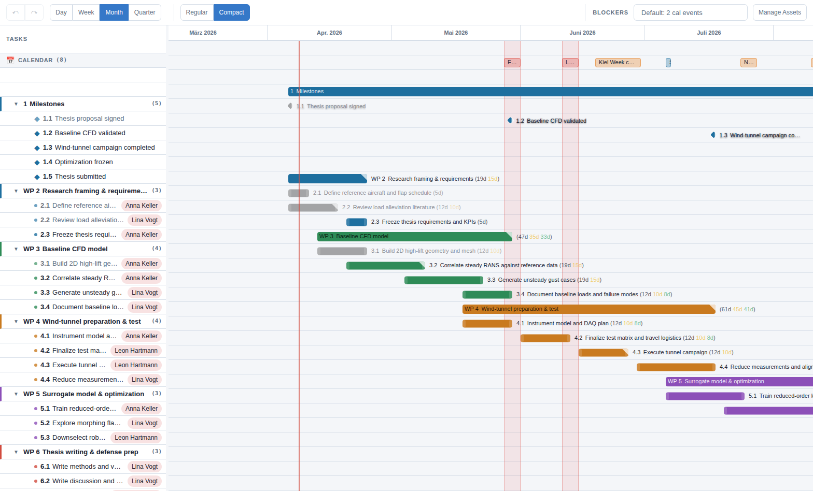

# Compare options

Now combine the earlier features. The sailor demo is a good example because optional regatta events compete directly with thesis deep-work time.

- move a task bar in the main schedule
- activate a blocker or calendar commitment
- check the impact on the same screen
- move the task again

That loop is the real value of the app. It helps you reason with the schedule instead of just documenting it.
