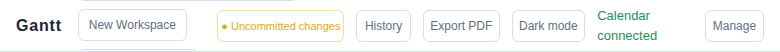

# Connect a personal calendar

Use the top-right header for this step.

- Click `Manage` beside `Calendar connected`.
- In the setup dialog, inspect the example local calendar entry.
- Replace it with your own `.ics` path or add a subscribed iCal URL when you are ready.

Safe first experiment:

- Keep the example calendar for now.
- Just open the dialog and notice how calendar sources are attached per workspace.

Why this matters:

- Calendar context is the core planning signal in this app.
- It turns a vague schedule into a realistic one.
