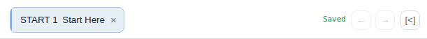

# Open, pin, and edit notes

Everything for this step happens in the notes panel on the right:

- the tabs at the top let you keep more than one note open
- the main editor area is where you write
- the small toolbar under the editor inserts common markdown patterns
- double-click a tab to make it permanent instead of temporary preview state

Suggested experiment:

- Keep one explanatory note open.
- Open a task note beside it.
- Edit one sentence so you can feel how lightweight this is.
- Double-click the task tab so it stays open while you browse elsewhere.

Why this is useful:

- Planning and thinking stay connected.
- You do not lose context while rescheduling.

Editor shortcuts worth trying:

- `Alt + 1` inserts a checkbox line
- `Alt + 2` inserts a bullet
- `Alt + 3` inserts a heading
- `Alt + 4` wraps selection in bold
- `Alt + 5` inserts a wiki link
- `Alt + 6` inserts a tag
