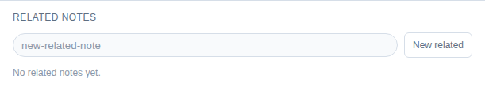

# Create a related checklist note

Look at the bottom of the notes panel for this step.

- The `Related notes` section is where you create small support notes.
- Use `New related` when the material belongs to the task but should not clutter the main note.

Examples:

- packing list
- call agenda
- risk checklist
- links and references

Try creating one and naming it after a very small sub-problem.
