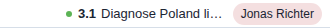

# Assign tasks to people or assets

Look at the task row itself.

- Assigned tasks show the person or asset name on the row.
- That assignment is what later makes blocker views meaningful.

Try this:

- Assign one task to Alex or another example resource.
- Translate that idea into a real person or asset from your own work.

Assignments turn the plan into something operational.
