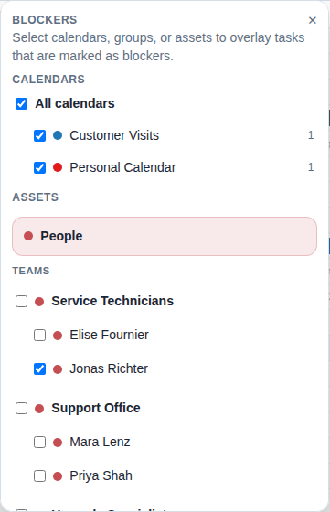

# Use blockers for a specific availability question

This task is marked as a blocker on purpose.

Use the blocker menu in the top toolbar to answer a concrete question such as:

- "If Alex is already busy here, where is the next feasible slot?"

Recommended habit:

- Select only the calendars and people relevant to the decision.
- Keep the overlay focused.
- Turn it off once the question is answered.
