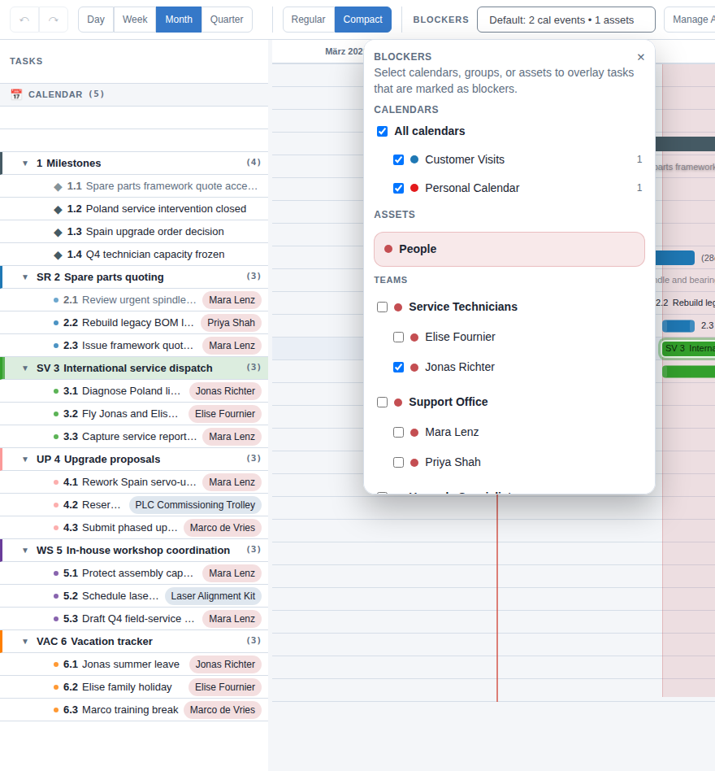

# Resources and blockers

This part of the app is for focused availability questions, not for painting the whole screen red.

This screenshot uses the mechanics demo because the question is very clear: can Jonas still take another service job?

- the selected technician is Jonas
- the blocker menu is open because this is a deliberate availability check
- the service-dispatch tasks stay visible behind the overlay so the decision stays grounded in real work

A good blocker scenario sounds like:

- "Can Alex still take this job?"
- "When is the van free?"
- "Do we have a clean camp window with coach, rib, and trailer all available?"
