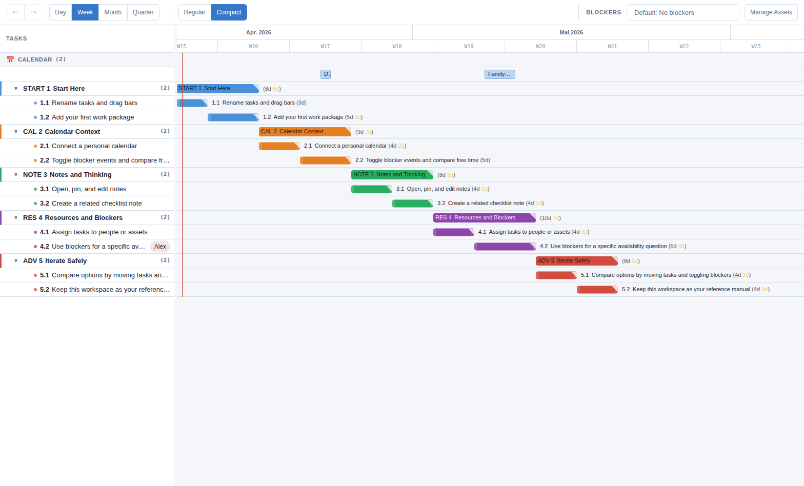

# App Guide

This workspace is a guided walkthrough of the app.

Where to look in this view:

- The left column is the task tree. This is where you select, rename, add, and reorder work.
- The bars on the right are the schedule view. Drag them to explore different timing options.
- The top toolbar controls zoom, row density, and blocker visibility.
- The top header is where you switch workspaces, open history snapshots, export, and manage calendars.
- The notes panel on the right explains the currently selected task.

Follow the groups from top to bottom:

- `START`: basic editing and date bars
- `CAL`: bringing your personal calendar into planning
- `NOTE`: keeping context and checklists next to tasks
- `RES`: assignment blockers for targeted availability checks
- `ADV`: comparing options, using history snapshots, and keeping this workspace as a reference

Interaction basics worth knowing from the start:

- single click a task to select it and preview its note
- double-click a task or group to open its editor
- shift + double-click a task or group to open its note as a pinned tab
- shift + drag a group bar to move the whole group in time
- right-click rows for add, edit, assign, and delete actions

Treat this workspace like a reference manual you can keep around.
